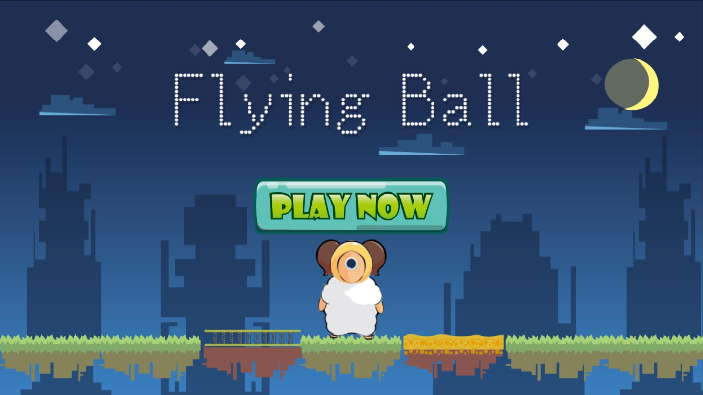
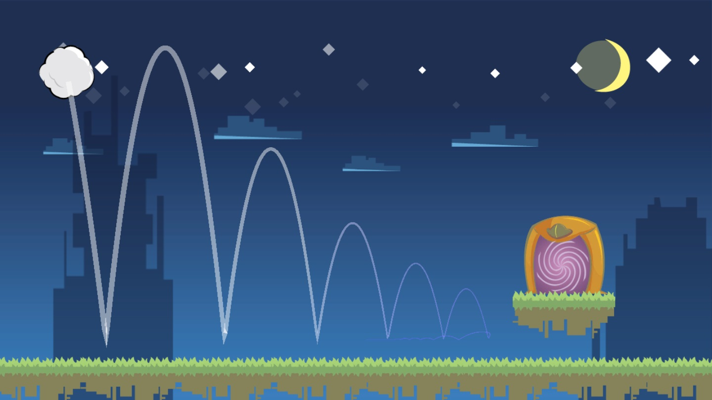
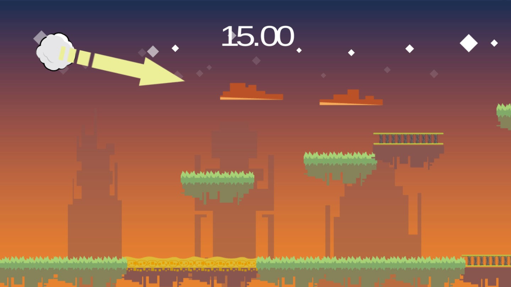
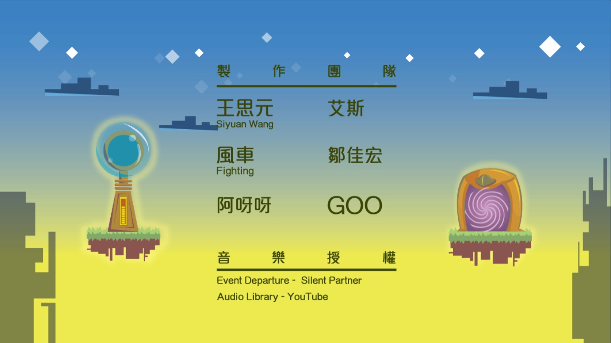
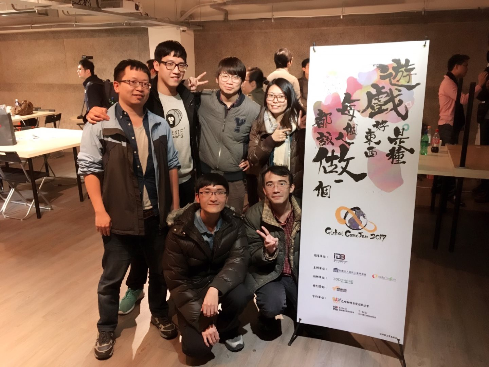

# FLYING BALL

## Waht is this
[Global game jam 2017](http://globalgamejam.org/2017/games/flying-ball) project, Group F at CLBC Taipei Taiwan, build a game in 48 hours.

We build a 2d horizontal scroll game, player shold determine the beginning of the ball's projectile angle, then fire the ball, let the ball reach the door to next level. Player can press some scene items to interactive when the ball flying.

Diversifier: This game offers theme variations based on the time of day when you played.

## How to use

This project was built on Unity 5.5.0f3.

## Demo

Online WebGL demo, [click here](https://github.com/GooKu/GGJ2017_F)

## Members

* [¤ý«ä¤¸ Siyuan Wang](http://twsiyuan.com)
* ¦ã´µ
* ­·¨® Fighting
* ¹Q¨Î§»
* ªü°Ú°Ú
* GOO

## License

[Attribution-NonCommercial-ShareAlike 4.0](https://creativecommons.org/licenses/by-nc-sa/4.0/)